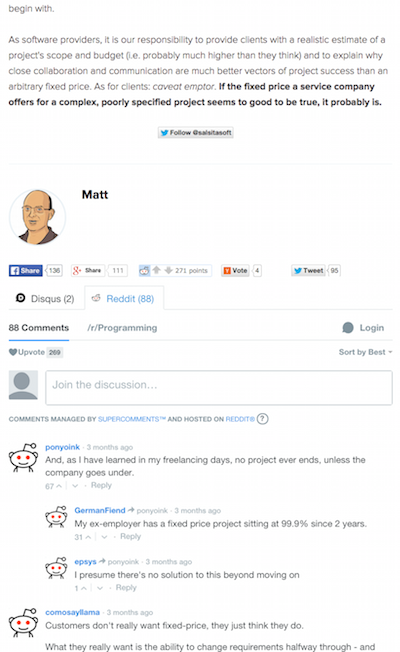

# Supercomments
*Reddit comment threads without leaving your blog or website!*


---

Don't you hate it when your blog post gets dozens of comments on Reddit but none on your own site? Supercomments lets you embed Reddit comment threads directly on your blog or website so the visitors don't have to go elsewhere to participate in the conversation. With Supercomments, you can do pretty much anything you can do on Reddit: post new comments, reply to existing comments, upvote, downvote and sort by date or relevance.

Supercomments is designed as an extension to the excellent [Disqus](http://www.disqus.com) commenting system. As such, visitors will be able to access both Disqus and Reddit comment threads in separate tabs using the same user interface. This means you even get features of Disqus that Reddit doesn't offer, like collapsing part of the discussion thread.

## Installing

### Get your Reddit API key
Log into Reddit and go to the [app preferences page](https://www.reddit.com/prefs/apps/). Create a new app, selecting the "installed app" type. Fill in whatever you want for name, just make sure you use the URL of your website as the redirect URI. Save the app and note down the consumer key (displayed under the app's name and "installed app" in the list of apps on your prefs page).

### Set up the OAuth redirect script
Put the following code in the `<head>` of your site's homepage:

```
    <script type="text/javascript">
        var code = window.location.href.match(/.*#access_token=(.[^&]+)/);
        var csrf = window.location.href.match(/.*&state=(.[^&]+)/);
        if (code && csrf) {
          window.opener.postMessage({ token: code[1], state: csrf[1] }, '*');
          window.close();
        }
    </script>
```

This code lets you use your homepage as the redirect URI for OAuth by detecting when the Reddit authorization page redirects to your site (which is done in a popup window), then posting the relevant information (access token and CSRF state) to the Supercomments frame and closing the popup.

If, for some reason, you can't use your homepage for this purpose, you can put this script on any webpage, including one you create expressly for this purpose. Just make sure you set the redirect URI of your Reddit app accordingly (see previous section).

# Add the Supercomments script
We are assuming that you already have Disqus running on your site. If not, consult [their instructions](https://javascripting.disqus.com/admin/install/) first. Once you have Disqus running, replace their code with the following:

```
      var supercommentsConfig = {
        url: 'http://blog.salsitasoft.com/why-we-dont-do-fixed-price-software-projects/',
        reddit: {
          consumerKey: [your_reddit_consumer_key]
          redirectUri: [your_website_url]
        },
        disqus: {
          identifier: [your_disqus_id] (optional)
          forum: [your_disqus_shortname]
        }
      };
    </script>
    <div id="supercomments"></div>
    <script src="../js/supercomments-embed.js"></script>
    ```

If you don't know how to get your Disqus ID, you should be okay omitting it since Disqus will use the URL of the post to identify it in this case.

## Building

If you want to build your own version of Supercomments, just pull the repository, run `npm install` and then run `gulp webpack-embed`. This will create the `supercomments-embed.js` file in `dist/js`.

Once you've built the normal version, you can create minify it by running `gulp compress-app` and then `gulp compress-embed`. This creates `supercomments.embed.min.js`.

To run the tests, use `npm test`.
